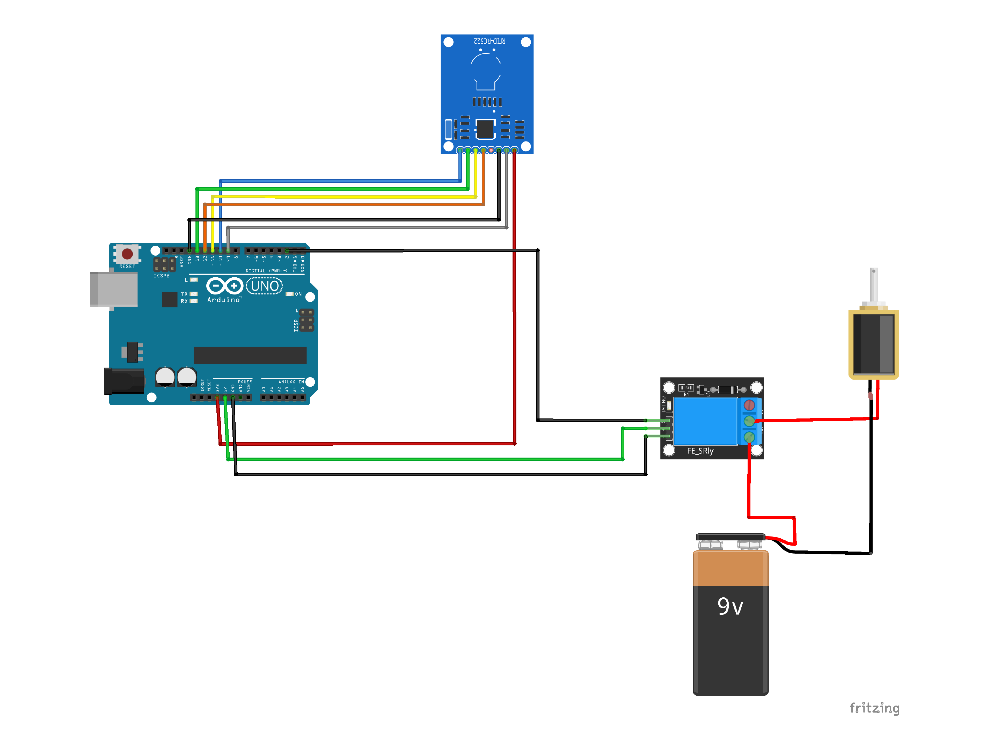

<!-- PROJECT LOGO -->
<br />
<div align="center">
  <a href="https://github.com/albinvar/smart-lock-uno">
    
  </a>
  
  <h3 align="center">💫 Multi-Level Authentication Smart Lock 🔐 ✨</h3>
    <h6 align="center">version 1.0.0 - beta 👨🏻‍💻</h6>

  <p align="center">
    A smart lock system with facial recognition, RFID authentication, and web API control using Arduino Uno and Python
    <br />
    <br />
    
    
    
    <a href="LICENCE"></a>
    <br />
    <br />
    <a href="#">View Demo (Not Available Yet)</a>
    ·
    <a href="https://github.com/albinvar/smart-lock-uno/issues">Report Bug</a>
    ·
    <a href="https://github.com/albinvar/smart-lock-uno/issues">Request Feature</a>
  </p>
</div>

> Warning ⚠️ : The project is still in its beta phase. Some part of the documentation may not be implemented properly.

<!-- TABLE OF CONTENTS -->
## Table of contents 🌈
  <ol>
    <li>
      <a href="#about-the-project-">About The Project</a>
      <ul>
        <li><a href="#requirements-">Requirements</a></li>
      </ul>
    </li>
    <li>
      <a href="#getting-started">Getting Started</a>
      <ul>
        <li><a href="#features-">Features</a></li>
	<ul>
		<li><a href="#facial-recognition-">Facial Recognition</a></li>
		<li><a href="#rfid-authentication-">RFID Authentication</a></li>
		<li><a href="#web-api-flask-">Web API</a></li>
      	</ul>
        <li><a href="#installation-%EF%B8%8F">Installation</a></li>
      </ul>
    </li>
    <li><a href="#usage-">Usage</a></li>
    <li><a href="#explanation-">Explanation</a></li>
    <li><a href="#contributing-">Contributing</a></li>
    <li><a href="#license-">License</a></li>
    <li><a href="#contact-">Contact</a></li>
    <li><a href="#acknowledgments-">Acknowledgments</a></li>
  </ol>


<!-- ABOUT THE PROJECT -->
## About The Project 🚀

Smart Lock Uno is a simple, versatile and reliable prototype for a secure access control system which is built with Arduino Uno and Python. With its modular design and open-source code, Smart Lock Uno provides a starting point for young innovators  to build their own customized access control solutions. Smart Lock Uno offers a flexible and affordable way to manage access control. 

This project is an open source implementation of a smart lock that allows users to unlock a door using three different authentication methods: 

- Facial Recognition  👦🏻
- RFID Authentication  💳
- Authentication through web API 🌐

The project uses an **Arduino Uno R3 microcontroller** and various electronic components to control a 12V solenoid lock.

## Requirements 🌠

To use this project, you will need the following components:

#### Hardware🔩

- Arduino Uno R3 microcontroller
- 12 V solenoid lock
- 3.3 V RFID reader
- Jumper Wires
- Laptop with webcam and internet connectivity
- 5 V single channel relay
- 12 V power supply 

#### Software 💻

- python v3.0
- pip

## Components that i bought. 🦾

| Component | Robu.in | Amazon |
|:------:|:------:|:------:|
|    **Arduino UNO R3**    |   [robu.in](https://robu.in/product/arduino-uno-r3/)  |  [amazon.in](https://amzn.eu/d/hJkeHbg)  |  
|    **Solenoid Lock**    |   [robu.in](https://robu.in/product/dc-12v-cabinet-door-lock-electric-lock-assembly-solenoid/)  |  [amazon.in](https://amzn.eu/d/6a30gYJ)  |  
|    **RFID-RC522 Module with rfid tags**    |   [robu.in](https://robu.in/product/mifare-rfid-readerwriter-13-56mhz-rc522-spi-s50-fudan-card-and-keychain/)  |  [amazon.in](https://amzn.eu/d/3c377VH)  |  
|    **5V Relay**    |   [robu.in](https://robu.in/product/1-channel-isolated-5v-relay-module-opto-coupler-for-arduino-pic-avr-dsp-arm/)  |  [amazon.in](https://amzn.eu/d/a4LfZPG)  |  
|    **Jumper Wires**    |   [robu.in](https://robu.in/product/male-to-female-jumper-wires-40pcs-20cm/)  |  [amazon.in](https://amzn.eu/d/2Io3cSo)  |  


## Features ✨

Three different authentication methods: facial recognition, RFID authentication, and authentication through a web API

- Uses a laptop's webcam / external webcam for facial recognition to cut down on costs.
- Trains facial recognition model using OpenCV Python.
- Handles all processing tasks directly from the laptop to minimize the load on the Arduino board.
- Uses Flask framework to connect the Arduino to the internet for web API authentication.
- Three authentication programs are split into separate threads to achieve concurrency.
- Sends signals to the Arduino board to unlock the solenoid lock for 10 seconds upon successful identification/authentication.
- Uses a 5V relay to switch the higher 12V power supply to solenoid lock using arduino.


## Installation ⚙️

To use this project, you will need the following components:

### Circuit Diagram 🔌



### Follow these steps to set up the project:

- Connect the Arduino board to your laptop via USB port

#### Connection on relay with ardiuno board

- Connect the 12V solenoid lock to a 5V relay, and connect the relay to the Arduino board

| 5V RELAY PIN | ARDUINO UNO PIN |
|:------:|:------:|
|    `VCC / +`    |   **5 V pin**   |
|    `GND / -`    |   **GND**   |
|    `IN / S`    |   **2**   |

#### Connection on solenoid lock with relay

- From the 12 V power supply, connect `+ ve` end with the `NO` port of relay. connect `- ve` end with the `- ve` end of solenoid lock.
- From the 5V Relay, connect `COM` port with the `+ ve` end of solenoid lock.

#### Connection of RFID reader module

- Connect the 3.3V RFID reader to the Arduino board, the connection pins are mentioned below.

| RFID-RC522 PIN | ARDUINO UNO PIN |
|:------:|:------:|
|    `SDA`    |   **10**   |
|    `SCK`    |   **13**   |
|    `MOSI`    |   **11**   |
|    `MISO`    |   **12**   |
|    `IRQ`    |   *UNUSED*   |
|    `GND`    |   **GND**   |
|    `RST`    |   **9**   |
|    `3.3 V`    |   **3.3 V**   |

- Clone the GitHub repository and open the project in your preferred IDE
- Install the required libraries and dependencies, which are listed in the `requirements.txt` file

```
pip install -r requirements.txt
```
- Copy/rename the `config.example.py` file to `config.py` and configure it with your desired settings.

#### Program your UNO board 

As said earlier, all the **computing tasks are done within the laptops processor & memory**.  So a board like UNO might be an **overkill** for this type of a project. Arduino Mini Pro or Arduino Nano could be sufficient as both of these supports RCC522-RFID module & other functions required by the project. So if you need to lower the expenses, go for a board like Nano or Mini Pro. The circuit diagrams & installation process will be updated soon for these boards.

The Arduino sketch for this project is available in the `/arduino` directory. You will find two different programs:

- `program.ino` - a simple program that controls the solenoid lock using `l` and `u` signals.
- `program_with_rfid` - the same as `program.ino`, but should be used if you plan to include RFID authentication.

To program your UNO board, connect it to your computer and open the Arduino IDE. Then, select the appropriate program and upload it to your board. Once the program is uploaded, your board is ready to use.

## Usage 🦄

- Run the `main.py` file to start the program 🚀

```
python main.py
```


## Explanation 👩‍🚀

The project aims in demonstrating a simple multi-level authentication smart lock which can be implemented at low cost while maintaining simplicity, efficiency & readability. The primary aim of this project is to lock/unlock a **solenoid lock**  by the 3 authentication methods mentioned above.

The project uses certain hardwares & softwares to achieve the desired outcome.

The project can be splitted into 5 parts :

	- Backend Part (Python)
	- Ardiuno Board Program (Ardiuno Sketch)
	- Web API (Flask Api - Python)
	- Front End Web Application (Nuxt Js or Laravel & Livewire)
	- Android App (sketchware)


As mentioned earlier, the three authentication methods are stored seperately on `src` directory.

```
├── 📂 src
│   ├── facial.py
│   ├── website.py
│   └── rfid.py
├── 📂 models ⚙️
│   └── trainer.yml
├── haarcascade_frontalface_default.xml
├── config.py
├── main.py
└── train.py
```

Inorder to achieve concurrency, all these authentication methods are executed on individual threads which makes authentication through all methods possible simultaneously.

- The face recognition thread always scans for faces in each frame captured by the video camera. If the authentication succeeds, the solenoid lock is unlocked for `x` seconds.

- The RFID reader continuously detects for RFID tags at a desired range. if an authorised card is detected, the solenoid lock is unlocked for `y` seconds.

- The Website API module creates a flask development server which continuously listens for requests from a port. (default : 5000).
inorder to share your local server to the internet, use a Tunneling service like Ngrok, Portmap.io, Serveo.net, Localhost.run etc... to integrate it to the app.

The unlock action requires a parameter `password` which can be set on the `config.py`

unlike the other 2 authentication methods, the unlock action helds the lock unlocked until a lock action is recieved. 

### Facial Recognition 👧

The facial recognition feature of the Smart Lock Uno is powered by the **OpenCV Python library**. It trains a machine learning model to recognize faces from images captured and stored in the configured directory. The recommended location to store images of authorized users is the `faces` directory located in the root folder. It is recommended to store images of each authorized user in separate folders with their name as the directory name.

The program utilizes the `haarcascade_frontalface_default.xml` pre-trained classifier which contains a set of features that are used to detect frontal faces in each frame. This helps in detecting faces in real-time while minimizing hardware costs as the program uses your laptop's or external webcam for facial recognition. The program can recognize multiple faces and provide access to authorized users based on the trained data stored at `trainer.yml`. Configurations such as threshold values can be adjusted in the `config.py` file.

The **Local Binary Patterns Histograms (LBPH)** algorithm is used to extract features from images or frames. The algorithm analyzes the texture of an image and identifies local binary patterns that are then used to form a histogram. The histogram is a representation of the distribution of binary patterns in the image/frame and helps identify unique features in a person's face. LBPH is a great choice for facial recognition as it is relatively easy to implement and can achieve good results with minimal computational resources.

In case an unauthorized person stands in front of the camera for too long, they are considered an intruder. The frame from the camera is extracted and stored in the` intruders` folder which can be accessed through the web API. The delay for taking unauthorized person's frames can be adjusted in the `config.py` file.

```
.
├── 📂 faces 👦🏻
│   ├── 📂 John Doe
│   │   ├─── img1.jpg
│   │   ├─── img2.jpg
│   │   └─── ...
│   ├── 📂 Dave 
│   │   ├─── img1.jpg
│   │   ├─── img2.jpg
│   │   └─── ...
│   └── ...
├── 📂 intruders 🧛
│   ├── intruder1.jpg
│   ├── intruder2.jpg
│   └── ...
├── 📂 models ⚙️
│   └── trainer.yml
├── haarcascade_frontalface_default.xml
├── config.py
├── main.py
├── train.py
└── ...
```
> PS : The directories mentioned above won't be present soon after installing the project. You may need to create it manually or it will be created upon execution.


## RFID Authentication 💳

RFID authentication is a non-contact method for verifying the identity of individuals. This authentication method uses an RFID reader attached to an Arduino board, which continuously listens for RFID tags at its desired frequency. When a RFID tag is detected by the reader, the tag is sent over the serial connection to the computer.

The `rfid.py` thread listens on the serial connection for RFID-specific messages, extracts the card ID from the message, and compares it with the authorized cards array defined in the `config.py` file. If the card ID matches with one of the authorized card IDs, the solenoid lock is unlocked for `y` seconds.

It's important to note that all processing tasks are specifically done at the operating system level. This means that the Arduino board only acts as a pass-through for the RFID tags, and all authentication and decision-making processes are handled on the computer. This approach offers more flexibility and security compared to using an RFID reader with an embedded authentication system.


## Web API (Flask) 🛸

The Web API is an additional authentication method that runs on a separate thread and uses a Flask-based API. Its codes are located in the `src/website.py` file. The Web API listens actively on a specific port for requests and uses requests to communicate with the API. The Website API is accessible via a local server, but it is recommended to use port forwarding tools like `ngrok` or `cloudflared tunnel` to access it from the wide area network.

The Website API requires a token to authorize each request, ensuring that only authenticated users can access the API. Unlike other authentication methods, the Website API does not have a delay to keep the solenoid lock unlocked. Instead, the lock is enabled only when a specific lock action request is received.

One of the key advantages of the Website API is its ability to serve all the intruder images stored in the Intruders folder. This feature allows users to view images of intruders and take appropriate action, such as notifying law enforcement. Additionally, the Website API provides an easy-to-use interface for interacting with the security system and monitoring its status.

#### API Documentation 

| HTTP Method | Endpoint | Parameters | Description |
|:------:|:------:|:------:|:------:|
|    `GET`    |    `/ping`    |    *N/A*    |    Checks if the system is up and running.   |
|    `POST`    |    `/lock`    |    - `action` <br> - `password` (if action is unlock)    |    Locks or unlocks the solenoid lock    |
|    `GET`    |    `/intruders`    |    *N/A*    |    Returns a list of images/frames captured for unauthorized persons    |
|    `GET`    |    `/intruders/{filename}`    |    `filename`    |    Returns a specific image    |


### Extras 👨‍🏫

##### PYTTSX3 Voice Synthesis Library.

This library is used to provide voice feedback for every authentication action performed through the three authentication methods. By utilizing the laptop speakers or external speakers, the system can provide real-time voice feedback to the user, giving them an audible confirmation that their authentication was successful or unsuccessful.

The voice feedback helps to improve the user experience and can also be beneficial in scenarios where the user is unable to view the screen, such as during hands-free operation. The voice feedback feature can be enabled or disabled in the `config.py`  file based on the user's preference. Also, the narrator voice, voice speed & other parameters can be changed through the `config.py`

###### What is the purpose of shared.py in the project?

The project implements three authentication methods that run concurrently on separate threads. Each of these methods requires a serial connection to communicate with the Arduino board. However, the board can only establish a single serial connection at a time. To address this limitation, a single serial connection is established and shared among all three threads. This allows all the methods to communicate with the board using the same connection.

While sharing a serial connection isn't generally recommended, in this case, it's the best solution for enabling multiple threads to communicate with the Arduino board without causing conflicts or issues in the program. The `shared.py` file serves as a container for the serial connection object, which can be accessed by all three threads to execute their authentication tasks.

###### How does telegram notification work?

Telegram notification feature is implemented in the system using a simple API which sends notifications to a specific chat ID. This feature enables the system to notify the user about events such as unauthorized access attempts and successful authentication.
The API implementation may be updated in the future for more robust and secure integration. As of now, a simple `post` request is used to send the notification message.

## Contributing 🌠

This project is open source and contributions are welcome. To contribute, please fork the repository, make your changes, and submit a pull request.

## License 📃

This project is licensed under the <a href="LICENSE">MIT License</a>. See the LICENSE file for more information.

## Contact 📞

If you have any questions, feedback, or suggestions for this project, please feel free to contact us:

- Name: **Albin Varghese**
- Email: albinvar@pm.me

[](https://www.buymeacoffee.com/albinvar)

## Acknowledgments 😊

This project was inspired by various smart lock projects available on the internet. Thanks to OpenCV Python and Flask for providing the tools necessary for facial recognition and web API authentication, respectively. Thanks to the Arduino community for providing helpful resources and support for this project. Additionally, thank you to ChatGPT, an AI language model trained by OpenAI, for generating helpful responses and contributing to the development of this project.
